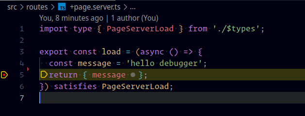

# NOTES

## Links

- [r/sveltejs - Enable VS Code breakpoints/debugging for Sveltekit server-side code with this](https://www.reddit.com/r/sveltejs/comments/11hsz5o/enable_vs_code_breakpointsdebugging_for_sveltekit/?utm_source=share&utm_medium=web2x&context=3&xpromo_edp=enabled)

## Bootstrap App

```shell
$ npm create svelte@latest my-app
# init repo
$ git init
$ git add .
$ git commit -am "first commit"
# add @vavite/node-loader
$ pnpm add -D @vavite/node-loader
```

## Vite Config

edit `vite.config.ts` as follows:

```ts
// added
import { nodeLoaderPlugin } from '@vavite/node-loader/plugin';

export default defineConfig({
  plugins: [
    sveltekit(),
    // added
    nodeLoaderPlugin()
  ]
});
```

## Config Scripts

Add the following to the scripts section of `package.json` `"debug": "vavite-loader vite dev"`

`package.json`

```json
{
  "scripts": {
    "debug": "vavite-loader vite dev",
  }
}
```

## Launch Config

create a new **Run and Debug Configuration**

```json
{
  "version": "0.2.0",
  "configurations": [
    {
      "name": "Launch via NPM : Server Code",
      "type": "node",
      "request": "launch",
      "runtimeExecutable": "npm",
      "runtimeArgs": [
        "run-script",
        "debug",
      ],
      "skipFiles": [
        "<node_internals>/**"
      ],
    },
   ]
}
```

## Add Client Side Test Page

add `src/routes/+page.svelte`

```svelte
<script lang="ts">
  import type { PageData } from './$types';

  export let data: PageData;

  $: (console.log(data.message));
</script>

<h1>{data.message}</h1>
```

> add breakpoint in line `$: (console.log(data.message));`

## Add Server Side Test Page

add `src/routes/+page.server.ts`

```ts
import type { PageServerLoad } from './$types';

export const load = (async () => {
  const message = 'hello debugger';
  return { message };
}) satisfies PageServerLoad;
```

> add breakpoint in line `return { message };`

## Launch debugger

launch debug configuration with `F5` or click button

change to `Debug console` we see

```shell
/usr/local/bin/npm run-script debug

> my-app@0.0.1 debug
> vavite-loader vite dev

run-script-pkg.js:54

dep-79892de8.js:12548

  VITE v4.2.1  ready in 1061 ms

  ➜  Local:   http://localhost:5173/
  ➜  Network: use --host to expose
```

## Test Breakpoints

now open url `http://localhost:5173/`

now we should stop in both client side and server side breakpoints




at last svelte with debugger and source maps working in CCS and SSR