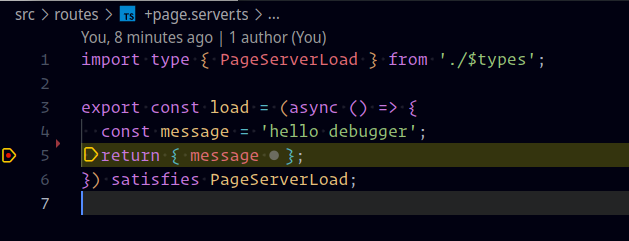
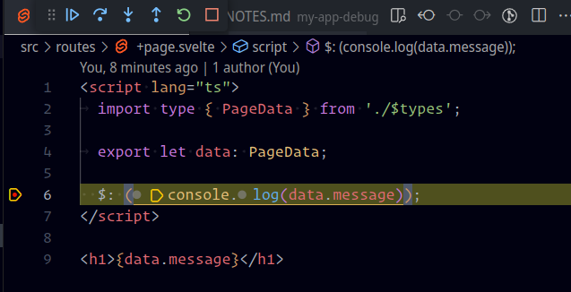

# README

read [NOTES](NOTES.md) for full steps

## TLDR

```shell
# used system
neofetch 
  OS: openSUSE Tumbleweed x86_64 
  Host: 82LM IdeaPad 5 14ALC05 
  Kernel: 6.2.6-1-default 
  Uptime: 31 mins 
  Packages: 3624 (rpm), 12 (flatpak), 1 (appimaged) 
  Shell: bash 5.2.15 
  Resolution: 1920x1080 
  DE: Plasma 5.27.3 
  WM: kwin 
  WM Theme: Breeze 
  Theme: Layan [Plasma], Breeze [GTK2/3] 
  Icons: Tela [Plasma], Tela [GTK2/3] 
  Terminal: guake 
  CPU: AMD Ryzen 5 5500U with Radeon Graphics (12) @ 2.100GHz 
  GPU: AMD ATI 04:00.0 Lucienne 
  Memory: 10509MiB / 15325MiB

# used node
$ node -v
v19.7.0

# install deps
$ pnpm i
```

## Add Client Side Breakpoint

`src/routes/+page.svelte`

add breakpoint in line `$: (console.log(data.message));`

```svelte
<script lang="ts">
  import type { PageData } from './$types';

  export let data: PageData;

  $: (console.log(data.message));
</script>

<h1>{data.message}</h1>
```

## Add Server Side Test Page

`src/routes/+page.server.ts`

add breakpoint in line `return { message };`

```ts
import type { PageServerLoad } from './$types';

export const load = (async () => {
  const message = 'hello debugger';
  return { message };
}) satisfies PageServerLoad;
```

## Launch debugger

launch debug configuration with `F5` or click button

## Test Breakpoints

now open url `http://localhost:5173/`

now we should stop in both client side and server side breakpoints





at last svelte with debugger and source maps working in CCS and SSR